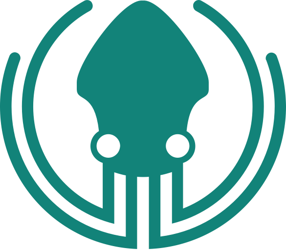
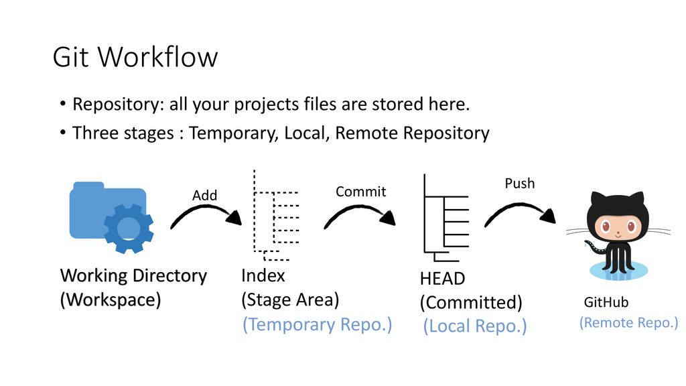

```{r setup, include=FALSE}
options(htmltools.dir.version = FALSE)

library(knitr)
library(xaringanExtra)

library(countdown)

opts_chunk$set(
  message = FALSE,
  comment = "",
  fig.dim  = c(5, 4.5),
  out.width = "100%"
)

options(width = 59) # fit into the rigth-column slides

```


class: center, top, bg_title, hide-count

# .alert[Introduzione a Git]

<br>
<br>
<br>
<br>
<br>
<br>
<br>
<br>
<br>
<br>
<br>
<br>

.orange[Master MLT]<br><br>--- University of Padova

\- Zoom, 2021  07/28 - 08/03


```{css, echo=FALSE}
pre {
  max-width: 100%;
  overflow-x: scroll;
}
.inverse {
  background-color: #272822;
  color: #d6d6d6;
  text-shadow: 0 0 20px #333;
}
.left-code {
  color: #777;
  width: 38%;
  height: 92%;
  float: left;
}
.right-code {
  color: #777;
  width: 55%;
  height: 92%;
  float: right;
  padding-top: 0.5em;
}
.left-plot {
  width: 43%;
  float: left;
}
.right-plot {
  width: 60%;
  float: right;
}

.full-line {
  width: 100%;
  float:left
}
.remark-code {
  font-size: 60%;
}

.bg_title {
  position: relative;
  z-index: 1;
}

.bg_title::before {    
      content: "";
      background-image: url('img/bg_title.png');
      background-size: contain;
      position: absolute;
      top: 0px;
      right: 0px;
      bottom: 0px;
      left: 0px;
      opacity: 0.5;
      z-index: -1;
}

.hide-count .remark-slide-number {
  display: none;
}
```

```{r xaringan-editable, echo=FALSE}
xaringanExtra::use_editable(expires = 1)
```

```{r xaringan-tachyons, echo=FALSE}
xaringanExtra::use_tachyons()
```

```{r xaringanExtra-freezeframe, echo=FALSE}
xaringanExtra::use_freezeframe()
```


---
class: inverse, center, bottom, hide-count


.right[

```{r, echo=FALSE, out.width = "40%"}
knitr::include_graphics(c("img/profilo_CL.jpg"))
```

# Potete contattarmi su...

[`r anicon::faa("envelope", animate = "passing")`](mailto:corrado.lanera@ubep.unipd.it) [corrado.lanera@ubep.unipd.it](mailto:corrado.lanera@ubep.unipd.it)

[`r anicon::faa("link", animate = "shake")`](https://www.CorradoLanera.it) [www.CorradoLanera.it](https://www.CorradoLanera.it)

[`r anicon::faa("twitter", animate = "float")`](https://twitter.com/corradolanera) [@CorradoLanera](https://twitter.com/corradolanera)

[`r anicon::faa("telegram-plane", animate = "vertical")`](https://telegram.me/CorradoLanera) [@CorradoLanera](https://telegram.me/CorradoLanera)

[`r anicon::faa("calendar-check")`](https://calendly.com/corradolanera) [calendly.com/corradolanera](https://calendly.com/corradolanera)

]


---
class: hide-count


# .orange[Outline]

- 
```{r out.width = "10%", echo = FALSE}

```
Git

- 
```{r out.width = "10%", echo = FALSE}

```
GitKraken

- 
```{r out.width = "10%", echo = FALSE}
knitr::include_graphics("img/github.png")
```
GitHub


---
class: inverse, middle, center, hide-count

# .orange[Git]


---

 
# Why a version-control system


.can-edit.key-likes[
- Evitare moltitudine di file con nomi diversi per le versioni
- capire aggiunte ed eliminazione tra versioni
- Controllo conflitti tra una versione e un'altra (per esempio modificate da persone differenti contemporaneamente)
- Unione di versioni assime (check compatibilità di modifiche effettuate da persone differenti)
- Permettere di fare tentativi (mantenendone traccia senza occupare spazio nel codice "ufficiale")
- tenere traccia di chi e quando modifica/aggiunge/toglie che cosa
log della storia del progetto e delle sue diramazioni
- thing one
- thing two
]


---

# .orange[GitKraken]

- A GUI for git (and GitHub)

```{r out.width = "100%", echo = FALSE}
knitr::include_graphics("img/diff-views.gif")
```


<small><small>
https://blog.axosoft.com/wp-content/uploads/2020/02/diff-views.gif
</small></small>


---
class: inverse, middle, hide-count

# .orange[Installation, check and setup]

- Git (https://git-scm.com/)^[If you need this tutorial, you can safely install **git** using all the installer's default options.]

- GitKraken (https://www.gitkraken.com/invite/fas3vkyk)


---

# Workspace, stage, and commits

- The workspace is the place in which you work
- The stage is the place in which things are ready to be committed
- Commits are snapshot of your project

```{r out.width = "90%", echo = FALSE}

```

<small><small>
https://slideplayer.com/slide/14860254/90/images/13/Git+Workflow+Repository%3A+all+your+projects+files+are+stored+here..jpg
</small></small>

---
class: inverse, middle, center, hide-count

# .orange[Live demo]


.left[
## Git

- New repo
- Stage
- Commit (and messages)


## GitKraken

- Tabs
- Create a project
- Understand the tree
]


---
class: inverse, middle, center, hide-count

# .orange[Your turn]

.left[
- create a git project from GitKraken
- create a file inside the repository's fodler
- add to the stage that file from GitKraken
- modify the file
- look at GitKraken

> what happened?

> what if you stage the new file?

> what if you unstage the old staged file?

- add a (Summary one-line) message and commit the file from GitKraken
]


```{r, echo=FALSE}
countdown(minutes = 5)
```


---
class: inverse, middle, center, hide-count

# .orange[Git]


---

# .orange[Branches]

- Track projects' ... branches

- Allow for

  - explorations
  - development versioning
  - subtasks
  - ...
  
.center[
```{r out.width = "70%", echo = FALSE}
knitr::include_graphics("img/git-branches-merge.png")
```
]

<small><small>
https://www.nobledesktop.com/image/gitresources/git-branches-merge.png
</small></small>

---
class: inverse, middle, center, hide-count

# .orange[Live demo]

.left[
## Git

- Create Branches
  - current commit
  - past commits
- Merge branches


## GitKraken

- Branch
- Merge
]


---
class: inverse, middle, center, hide-count

# .orange[Your turn]


.left[
- (create a git project with some content))

 

- add some commits
- create a branch and check it out
- add some commit to it
- merge it with the main branch

 

- start a branch from a previous commit
- made some different changes to some files
- merge the new branch with the master one
- resolve potential conflicts

> where in the tree the changes happenes?
> can you merge that branch with the current?
]

```{r, echo=FALSE}
countdown(minutes = 5)
```


---
class: inverse, middle, center, hide-count


# .orange[Live demo]

.left[
> WARNING: deleating a branch


What can happen?

Please, suggests:
.can-edit.key-branch-delete[
- If the branch is already merged: 

- If the branch is not merged yet: 
]
]


---
class: inverse, middle, center, hide-count

# .orange[GitHub]

---

# .orange[GitHub]


.center[
```{r out.width = "100%", echo = FALSE}
knitr::include_graphics("img/what-is-github.png")
```
]

<small><small>
https://static.javatpoint.com/tutorial/git/images/what-is-github.png
</small></small>


---
class: inverse, middle, center, hide-count

# .orange[Account, check and setup]

.left[
- GitKraken

  - link GitKraken to GitHub, adding ssh key to GitHub too
    (from `<GitKraken>/file/preferences/integration`)

- R

  - {remotes} to install remotes (e.g., from GitHub) packages
     - `remotes::install_github(<username/repo>)`
    
  - {usethis} utilities for everyday R workflows
     - `usethis::create_github_token()`
    
  - {gitcreds} R interface for the git's credential manager
     - `gitcreds::gitcreds_get()`
     - `gitcreds::gitcreds_set()`
     - `gitcreds::gitcreds_get()$password`
]


---

# .orange[GitHub: collaborating]

- Issue tracker

- Pull requests

.center[
```{r out.width = "100%", echo = FALSE}
knitr::include_graphics("img/Github-pullrequest.png")
```
]

<small><small>
https://cdn.crunchify.com/wp-content/uploads/2017/09/Github-WorkFlow-Tips-Crunchify-Tips.png
</small></small>


---
class: inverse, middle, center, hide-count


# .orange[Live demo]

.left[
- Issue
- Pull Request
]


---
class: inverse, middle, center, hide-count


# .orange[Your Turn]

.left[

1. create an issue
2. create a branch to resolve the issue
3. solve it


- add a message, commit, **push**

 

- repeat 1-3
- add a message, commit, create a **pull-request**

]

```{r, echo=FALSE}
countdown(minutes = 5)
```


---

# .orange[GitHub: collaborating]

.center[
```{r out.width = "100%", echo = FALSE}

```
]

<small><small>
https://encrypted-tbn0.gstatic.com/images?q=tbn:ANd9GcTpPgnTW0xIg12tiOVCCaKYuRfebp6mrncxJYO4Hrv1cnIePhv3fxBfyczTdoJnLkgK5CM&usqp=CAU
</small></small>


---
class: inverse, middle, center, hide-count


# .orange[Your Turn]

.left[

### First phase (as contributors)
- Fork a project of one of your colleagues
- Do some modification to the forked project 
- Create a pull request

### Second phase (as owner)
- Review the pull request
- possibly start a conversation to it or request some modification
- when you are satisfy accept the pull-request and merge the branch

### Third phase (as contributor)
- keep updated (fetch-all / pull) the forked project


> How many remotes have a forked project?


]

```{r, echo=FALSE}
countdown(minutes = 10)
```


---
class: inverse, center, middle, hide-count

# Congratulations and Thanks!

# `r anicon::faa('thumbs-up', animate='float', size=5)`

<br>

.right[
[`r anicon::faa("envelope", animate = "passing")`](mailto:corrado.lanera@ubep.unipd.it) [corrado.lanera@ubep.unipd.it](mailto:corrado.lanera@ubep.unipd.it)

[`r anicon::faa("calendar-check")`](https://calendly.com/corradolanera) [calendly.com/corradolanera](https://calendly.com/corradolanera)

]

